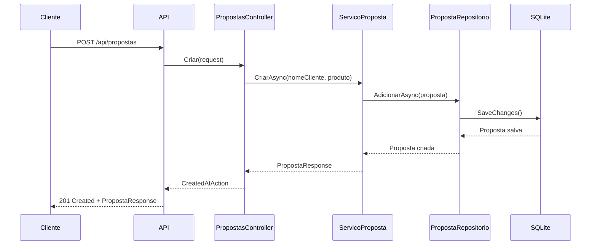
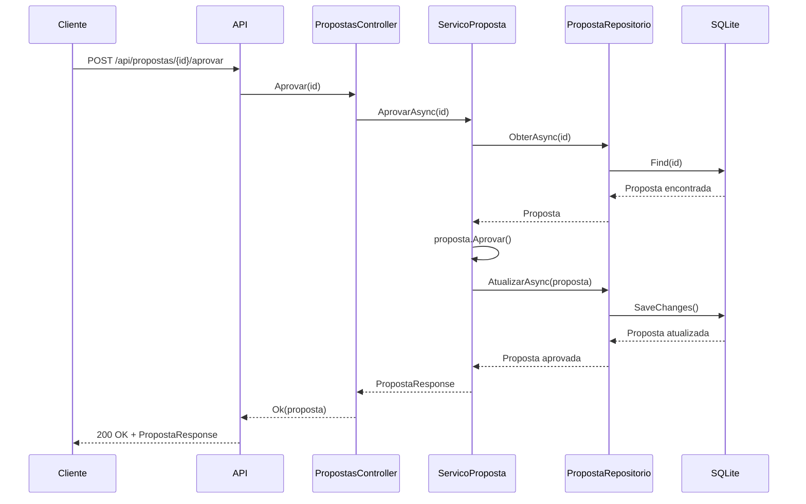
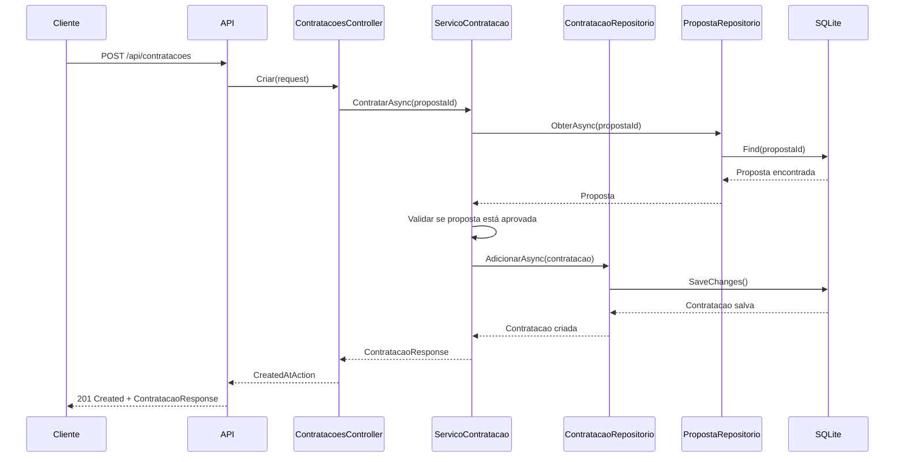

# Diagrama Detalhado da Aplicação - Sistema de Seguros

## Arquitetura Detalhada com Fluxos de Dados

```mermaid
graph TB
    subgraph "Client Layer"
        CLIENT[Cliente/Usuário]
        POSTMAN[Postman/Insomnia]
        SWAGGER_UI[Swagger UI]
    end
    
    subgraph "API Gateway Layer"
        API[ASP.NET Core API]
        MIDDLEWARE[Middleware Pipeline]
        VALIDATION[Model Validation]
        ROUTING[Routing Engine]
    end
    
    subgraph "Controller Layer"
        PC[PropostasController]
        CC[ContratacoesController]
        
        subgraph "Propostas Endpoints"
            POST_P[POST /api/propostas]
            GET_P[GET /api/propostas]
            GET_P_ID[GET /api/propostas/{id}]
            POST_APROVAR[POST /api/propostas/{id}/aprovar]
            POST_REJEITAR[POST /api/propostas/{id}/rejeitar]
        end
        
        subgraph "Contratações Endpoints"
            POST_C[POST /api/contratacoes]
            GET_C[GET /api/contratacoes]
        end
    end
    
    subgraph "DTO Layer"
        subgraph "Request DTOs"
            CPR[CriarPropostaRequest]
            CCR[CriarContratacaoRequest]
        end
        
        subgraph "Response DTOs"
            PR[PropostaResponse]
            CR[ContratacaoResponse]
        end
    end
    
    subgraph "Application Service Layer"
        SP[ServicoProposta]
        SC[ServicoContratacao]
        
        subgraph "Proposta Operations"
            CRIAR_P[CriarAsync]
            LISTAR_P[ListarAsync]
            OBTER_P[ObterAsync]
            APROVAR_P[AprovarAsync]
            REJEITAR_P[RejeitarAsync]
        end
        
        subgraph "Contratação Operations"
            CONTRATAR_C[ContratarAsync]
            LISTAR_C[ListarAsync]
        end
    end
    
    subgraph "Domain Layer"
        subgraph "Entities"
            PROPOSTA[Proposta]
            CONTRATACAO[Contratacao]
        end
        
        subgraph "Value Objects"
            STATUS[StatusProposta]
            NOME_CLIENTE[NomeCliente]
            PRODUTO[Produto]
        end
        
        subgraph "Domain Rules"
            VALIDACAO_P[Validação Proposta]
            TRANSICAO_STATUS[Transição de Status]
            REGRA_CONTRATACAO[Regra de Contratação]
        end
    end
    
    subgraph "Repository Layer"
        IPR[IPropostaRepositorio]
        ICR[IContratacaoRepositorio]
        PR_IMPL[PropostaRepositorio]
        CR_IMPL[ContratacaoRepositorio]
    end
    
    subgraph "Infrastructure Layer"
        DBCONTEXT[AppDbContext]
        EF_CORE[Entity Framework Core]
        
        subgraph "Database"
            SQLITE[(SQLite Database)]
            TABLES[Tabelas:<br/>Propostas<br/>Contratacoes]
            MIGRATIONS[Migrations]
        end
        
        subgraph "Configuration"
            APPSETTINGS[appsettings.json]
            CONNECTION_STRING[Connection String]
        end
    end
    
    subgraph "Deployment & Runtime"
        subgraph "Development"
            DEV_SERVER[Development Server<br/>Porta 5171]
            HOT_RELOAD[Hot Reload]
        end
        
        subgraph "Production"
            DOCKER_CONTAINER[Docker Container<br/>Porta 8080]
            DOCKERFILE[Dockerfile]
        end
        
        subgraph "Database Management"
            AUTO_MIGRATE[Auto Migration<br/>on Startup]
            DB_FILE[propostas.db]
        end
    end
    
    %% Client connections
    CLIENT --> API
    POSTMAN --> API
    SWAGGER_UI --> API
    
    %% API Layer
    API --> MIDDLEWARE
    MIDDLEWARE --> VALIDATION
    VALIDATION --> ROUTING
    
    %% Controller connections
    ROUTING --> PC
    ROUTING --> CC
    
    PC --> POST_P
    PC --> GET_P
    PC --> GET_P_ID
    PC --> POST_APROVAR
    PC --> POST_REJEITAR
    
    CC --> POST_C
    CC --> GET_C
    
    %% DTO connections
    POST_P --> CPR
    POST_C --> CCR
    PC --> PR
    CC --> CR
    
    %% Service connections
    PC --> SP
    CC --> SC
    
    SP --> CRIAR_P
    SP --> LISTAR_P
    SP --> OBTER_P
    SP --> APROVAR_P
    SP --> REJEITAR_P
    
    SC --> CONTRATAR_C
    SC --> LISTAR_C
    
    %% Domain connections
    SP --> PROPOSTA
    SC --> CONTRATACAO
    PROPOSTA --> STATUS
    PROPOSTA --> NOME_CLIENTE
    PROPOSTA --> PRODUTO
    PROPOSTA --> VALIDACAO_P
    PROPOSTA --> TRANSICAO_STATUS
    CONTRATACAO --> REGRA_CONTRATACAO
    
    %% Repository connections
    SP --> IPR
    SC --> ICR
    IPR --> PR_IMPL
    ICR --> CR_IMPL
    
    %% Infrastructure connections
    PR_IMPL --> DBCONTEXT
    CR_IMPL --> DBCONTEXT
    DBCONTEXT --> EF_CORE
    EF_CORE --> SQLITE
    SQLITE --> TABLES
    SQLITE --> MIGRATIONS
    
    %% Configuration
    APPSETTINGS --> CONNECTION_STRING
    CONNECTION_STRING --> DBCONTEXT
    
    %% Deployment
    API --> DEV_SERVER
    API --> DOCKER_CONTAINER
    DOCKER_CONTAINER --> DOCKERFILE
    DBCONTEXT --> AUTO_MIGRATE
    AUTO_MIGRATE --> DB_FILE
    
    %% Styling
    style API fill:#e3f2fd
    style PROPOSTA fill:#f3e5f5
    style CONTRATACAO fill:#f3e5f5
    style SQLITE fill:#e8f5e8
    style DOCKER_CONTAINER fill:#fff3e0
    style DEV_SERVER fill:#fce4ec
```

## Fluxos de Processo Detalhados

### 1. Fluxo de Criação de Proposta



### 2. Fluxo de Aprovação de Proposta



### 3. Fluxo de Contratação



## Estrutura de Dados

### Tabela Propostas
```sql
CREATE TABLE Propostas (
    Id TEXT PRIMARY KEY,
    NomeCliente TEXT NOT NULL,
    Produto TEXT NOT NULL,
    CriadaEmUtc TEXT NOT NULL,
    Status INTEGER NOT NULL
);
```

### Tabela Contratacoes
```sql
CREATE TABLE Contratacoes (
    Id TEXT PRIMARY KEY,
    PropostaId TEXT NOT NULL,
    DataContratacaoUtc TEXT NOT NULL,
    FOREIGN KEY (PropostaId) REFERENCES Propostas(Id)
);
```

## Regras de Negócio Implementadas

### Proposta
1. **Criação**: Nome do cliente e produto são obrigatórios
2. **Status**: Inicialmente "EmAnalise"
3. **Transições**: 
   - EmAnalise → Aprovada (via aprovar)
   - EmAnalise → Rejeitada (via rejeitar)
   - Aprovada/Rejeitada → Não pode mais ser alterada

### Contratação
1. **Validação**: Só pode contratar propostas aprovadas
2. **Unicidade**: Uma proposta só pode gerar uma contratação
3. **Data**: Data de contratação é definida automaticamente

## Configurações de Ambiente

### Development (appsettings.Development.json)
```json
{
  "ConnectionStrings": {
    "Default": "Data Source=propostas.db"
  },
  "Logging": {
    "LogLevel": {
      "Default": "Information"
    }
  }
}
```

### Production (Docker)
```dockerfile
FROM mcr.microsoft.com/dotnet/aspnet:8.0
WORKDIR /app
COPY . .
EXPOSE 8080
ENTRYPOINT ["dotnet", "Teste Tecnico INDT.dll"]
```

## Monitoramento e Logs

- **Swagger**: Documentação automática da API
- **Entity Framework Logs**: Queries SQL executadas
- **ASP.NET Core Logs**: Requisições HTTP
- **Docker Logs**: Logs do container em produção
