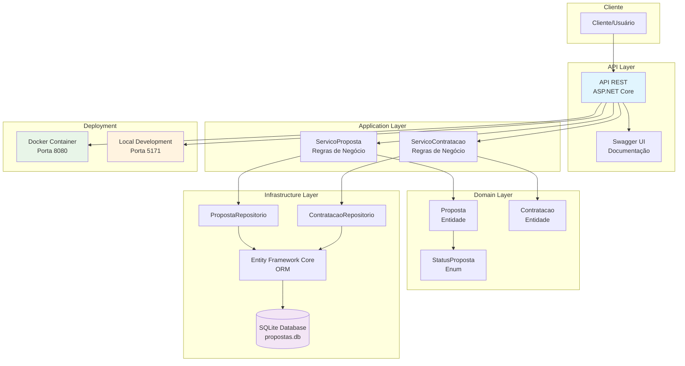

# Diagrama de Infraestrutura - Sistema de Seguros

## Visão Geral da Arquitetura

## Componentes Principais

### 1. **API Layer**
- **Controllers**: `PropostasController`, `ContratacoesController`
- **DTOs**: `CriarPropostaRequest`, `PropostaResponse`, `CriarContratacaoRequest`, `ContratacaoResponse`
- **Swagger**: Documentação automática da API

### 2. **Application Layer**
- **Serviços**: Orquestração de regras de negócio
- **Interfaces**: `IServicoProposta`, `IServicoContratacao`

### 3. **Domain Layer**
- **Entidades**: `Proposta`, `Contratacao`
- **Enums**: `StatusProposta` (EmAnalise, Aprovada, Rejeitada)
- **Validações**: Regras de domínio encapsuladas

### 4. **Infrastructure Layer**
- **Database**: SQLite com arquivo `propostas.db`
- **ORM**: Entity Framework Core
- **Repositórios**: Implementação de persistência
- **Migrations**: Controle de versão do banco

### 5. **Deployment Options**
- **Docker**: Containerização com porta 8080
- **Local**: Desenvolvimento com porta 5171
- **Auto-migration**: Aplicação automática de migrações no startup

## Fluxo de Dados

1. **Cliente** faz requisição HTTP para a **API**
2. **Controller** recebe e valida a requisição
3. **Serviço** processa as regras de negócio
4. **Repositório** persiste/recupera dados via **Entity Framework**
5. **SQLite** armazena os dados
6. **Response** é retornada ao cliente

## Tecnologias Utilizadas

- **.NET 8**: Framework principal
- **ASP.NET Core**: Web API
- **Entity Framework Core**: ORM
- **SQLite**: Banco de dados
- **Docker**: Containerização
- **Swagger**: Documentação da API
